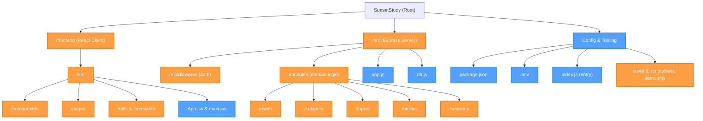
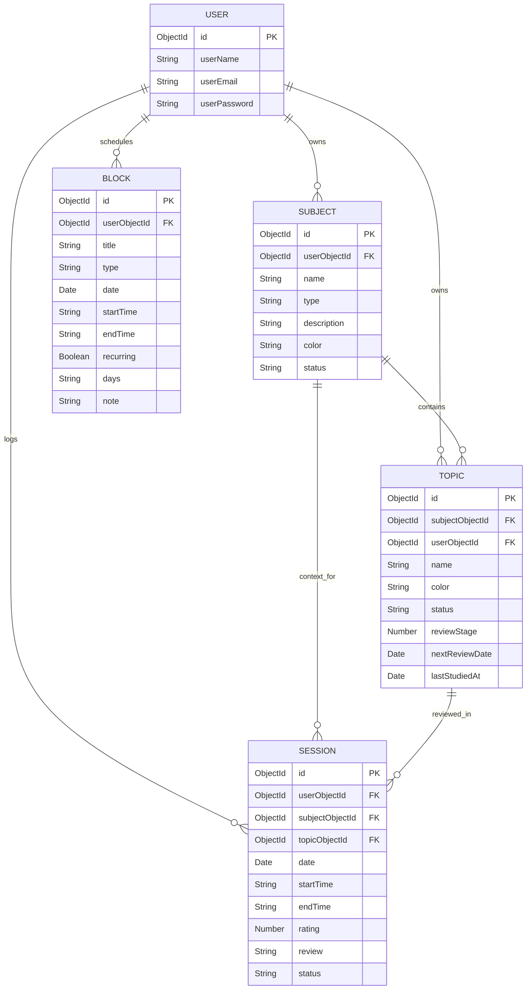
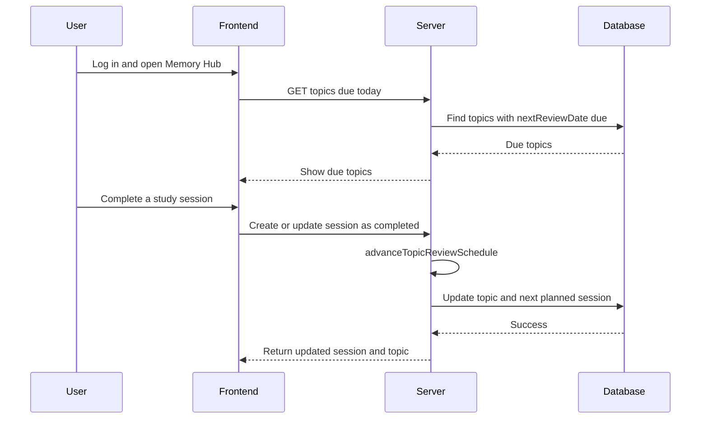

<div align="center">
  <h1>🌅 SunsetStudy</h1>
  <p><i>A beautifully crafted Study Management System designed around the Ebbinghaus Forgetting Curve. Study smarter, not longer! 🧠✨</i></p>

  
</div>

<br />

## Problem Description

Traditional study methods often lead to the **"Illusion of Competence"** students read material once, feel they know it, but experience rapid forgetting soon after. Without a systematic approach to reviewing materials, students struggle to manage their time effectively, lose track of what needs to be reviewed, and inevitably resort to stressful, low-retention cramming before exams.

## Proposed Solution

**SunsetStudy** introduces a systematic, automated study planner built on the proven **Ebbinghaus Forgetting Curve**. Instead of relying on manual scheduling, the app intelligently calculates your next review dates using **Spaced Repetition**. By organizing learning into Subjects, Topics, Study Blocks, and Study Sessions, SunsetStudy ensures that you review information exactly when you're about to forget it—optimizing long-term memory retention.

---

## Features

- **Spaced Repetition Algorithm:** Automatically schedules the next review using intervals of **1, 3, 7, 14, 30, and 60 days** after each completed session. Topics with `nextReviewDate` on or before today appear as due.
- **Subject & Topic Hierarchy:** Categorize learning into **Academic**, **Hobby**, or **Project** subjects; track each topic from **Not Started** → **In Progress** → **Done**.
- **Time Management Calendar:** Schedule recurring or one-off **Study Blocks** (lectures, work, family time, etc.) separately from topic **Sessions**.
- **Session Logging:** Plan and complete study sessions per topic; completing a session advances the topic’s review schedule and can auto-create the next planned session.
- **Secure Authentication:** JWT-based registration and login with bcrypt-hashed passwords.
- **Beautiful, Fun UI:** Sunset-themed aesthetics with engaging, modern, and accessible design (Memory Hub, Timeline, Library, Sessions).

---

## Technologies Used

### Frontend
- **React 19** with **Vite** (fast development and builds)
- **Tailwind CSS v4** (utility-first styling via `@tailwindcss/vite`)
- **Framer Motion** (micro-interactions and animations)
- **React Router DOM v7** (client-side routing)
- **React Big Calendar** (schedule visualization)
- **Axios** (API communication)

### Backend
- **Node.js & Express.js** (REST API)
- **MongoDB & Mongoose** (document database)
- **JSON Web Tokens (JWT)** (stateless authentication)
- **Bcrypt.js** (password hashing)
- **Zod** (request validation)

---

## File & Folder Structure



---

## Architecture Diagrams

### Entity-Relationship Diagram (Database)

Study **Blocks** (calendar commitments) and **Sessions** (topic study logs) are separate: sessions link to subjects and topics, not to blocks.



Enum values in the app: **Subject** `type` — `academic`, `hobby`, `project`; `status` | `active`, `archived`. **Topic** `status` — `not started`, `in progress`, `done`. **Block** `type` — `lecture`, `sleep`, `family`, `work`, `other`. **Session** `status` — `planned`, `completed`.

### Spaced Repetition Workflow

When a session is created or updated with `status: "completed"`, the server advances the topic’s `reviewStage` and `nextReviewDate`, and may create the next **planned** session automatically.

---

## API Endpoints

Protected routes (`/subjects`, `/topics`, `/blocks`, `/sessions`) require the header:

`Authorization: Bearer <your_jwt_token>`

### Users (public)
| Method | Path | Description |
|--------|------|-------------|
| `POST` | `/users/register` | Register a new account |
| `POST` | `/users/login` | Authenticate and receive a JWT |
| `GET` | `/users` | List users |
| `GET` | `/users/:id` | Get user by ID |
| `PATCH` | `/users/:id` | Update user |
| `DELETE` | `/users/:id` | Delete user |

**Register** body example:
```json
{
  "userName": "student01",
  "userEmail": "student@example.com",
  "userPassword": "SecurePass1!"
}
```

**Login** body example:
```json
{
  "userEmail": "student@example.com",
  "userPassword": "SecurePass1!"
}
```

### Subjects (auth required)
| Method | Path | Description |
|--------|------|-------------|
| `GET` | `/subjects` | List subjects for the user |
| `GET` | `/subjects/:id` | Get one subject |
| `POST` | `/subjects` | Create a subject |
| `PATCH` | `/subjects/:id` | Update a subject |
| `DELETE` | `/subjects/:id` | Delete a subject |

**Create subject** body example (`userObjectId` is set automatically from your JWT):
```json
{
  "name": "Data Structures",
  "type": "academic",
  "description": "CS201 Core Module",
  "color": "#FF5733"
}
```

### Topics (auth required)
| Method | Path | Description |
|--------|------|-------------|
| `GET` | `/topics/due-today` | Topics due for review today (spaced repetition) |
| `GET` | `/topics` | List topics |
| `GET` | `/topics/:id` | Get one topic |
| `POST` | `/topics` | Create a topic under a subject |
| `PATCH` | `/topics/:id` | Update a topic |
| `DELETE` | `/topics/:id` | Delete a topic |

### Blocks (auth required)
| Method | Path | Description |
|--------|------|-------------|
| `GET` | `/blocks` | List calendar blocks |
| `GET` | `/blocks/:id` | Get one block |
| `POST` | `/blocks` | Create a time block |
| `PATCH` | `/blocks/:id` | Update a block |
| `DELETE` | `/blocks/:id` | Delete a block |

### Sessions (auth required)
| Method | Path | Description |
|--------|------|-------------|
| `GET` | `/sessions` | List study sessions |
| `GET` | `/sessions/:id` | Get one session |
| `POST` | `/sessions` | Create a session; if `status` is `completed`, updates topic schedule |
| `PATCH` | `/sessions/:id` | Update a session; marking `completed` triggers spaced repetition |
| `DELETE` | `/sessions/:id` | Delete a session |

---

## Setup Instructions

1. **Clone the repository**
   ```bash
   git clone https://github.com/Naveen-nm27/SunsetStudy.git
   ```

2. **Navigate to the project directory**
   ```bash
   cd SunsetStudy
   ```

3. **Install backend dependencies** (from the repo root)
   ```bash
   npm install
   ```

4. **Install frontend dependencies**
   ```bash
   cd frontend
   npm install
   cd ..
   ```

5. **Environment variables**

   Create a `.env` file in the **project root**:

   ```env
   PORT=3000
   MONGODB_URI=your_mongodb_connection_string
   JWT_SECRET=your_super_secret_jwt_key
   ```

   `MONGODB_URI` is required by `src/db.js` and the demo seed script.

6. **Optional: load demo data**
   ```bash
   npm run seed:demo
   ```

---

## How to Run the Project

Use two terminals—backend and frontend.

**Terminal 1 — Backend** (from the repo root):
```bash
npm start
```
Starts the API on `http://localhost:3000` (default `PORT` from `.env` or `3000`). Uses **nodemon** for reload on file changes.

**Terminal 2 — Frontend** (from `frontend/`):
```bash
npm run dev
```
Starts the Vite dev server (default `http://localhost:5173`). The client calls the API at `http://localhost:3000` (see `frontend/src/api.js`).

### App routes (frontend)

| Path | Description |
|------|-------------|
| `/` | Landing page |
| `/login`, `/register` | Authentication |
| `/dashboard/memory` | Memory Hub (due topics) |
| `/dashboard/timeline` | Timeline / calendar |
| `/dashboard/library` | Subjects & topics library |
| `/dashboard/sessions` | Study sessions |
| `/profile` | User profile (protected) |

---
<div align="center">
  
  <p><b>Happy Studying! 🌅📚</b></p>
</div>
