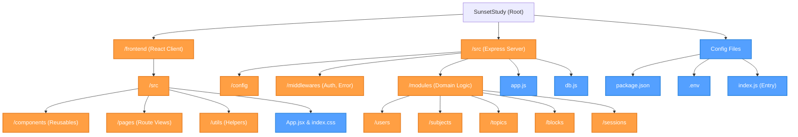
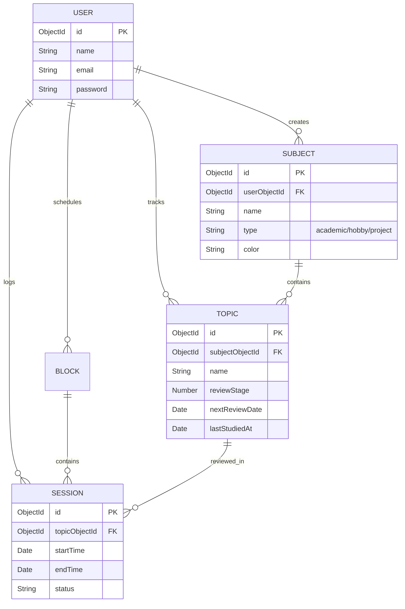
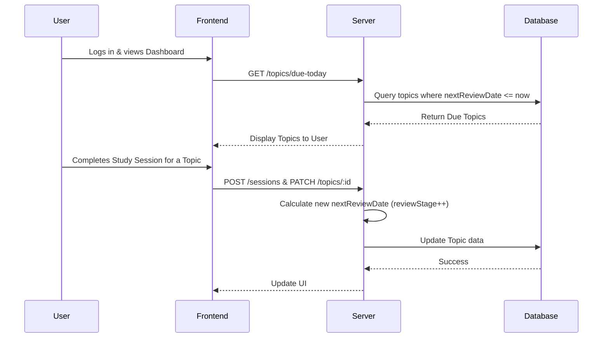

<div align="center">
  <h1>🌅 SunsetStudy</h1>
  <p><i>A beautifully crafted Study Management System designed around the Ebbinghaus Forgetting Curve. Study smarter, not longer! 🧠✨</i></p>

  
</div>

<br />

## Problem Description

Traditional study methods often lead to the **"Illusion of Competence"**—students read material once, feel they know it, but experience rapid forgetting soon after. Without a systematic approach to reviewing materials, students struggle to manage their time effectively, lose track of what needs to be reviewed, and inevitably resort to stressful, low-retention cramming before exams.

## Proposed Solution

**SunsetStudy** introduces a systematic, automated study planner built on the proven **Ebbinghaus Forgetting Curve**. Instead of relying on manual scheduling, the app intelligently calculates your next review dates using **Spaced Repetition**. By organizing learning into Subjects, Topics, Study Blocks, and Study Sessions, SunsetStudy ensures that you review information exactly when you're about to forget it—optimizing long-term memory retention.

---

## Features

- **Spaced Repetition Algorithm:** Automatically calculates and prompts topics that are "Due Today" based on your previous study sessions.
- **Subject & Topic Hierarchy:** Categorize learning into Academics, Hobbies, or Projects.
- **Time Management Calendar:** Visually manage Study Blocks and individual Sessions.
- **Progress Tracking:** Monitor the review stages of your topics from "Not Started" to "Done".
- **Secure Authentication:** JWT-based secure user registration and login.
- **Beautiful, Fun UI:** Sunset-themed aesthetics with highly engaging, modern, and accessible design.

---

## Technologies Used

### Frontend
- **React 19** with **Vite** (Blazing fast development)
- **TailwindCSS v4** (Modern utility-first styling)
- **Framer Motion** (Fluid micro-interactions and animations)
- **React Router DOM** (Client-side routing)
- **React Big Calendar** (Dynamic schedule visualization)
- **Axios** (API communication)

### Backend 
- **Node.js & Express.js** (Robust REST API architecture)
- **MongoDB & Mongoose** (NoSQL Database for flexible document models)
- **JSON Web Tokens (JWT)** (Stateless, secure authentication)
- **Bcrypt.js** (Password hashing)
- **Zod** (Strict schema validation)

---

## File & Folder Structure



---

## Architecture Diagrams

### Entity-Relationship Diagram (Database)



### Spaced Repetition Workflow



---

## API Endpoints

### Users
- `POST /users/register` - Register a new account.
- `POST /users/login` - Authenticate user & get JWT.
  ```json
  // Request Body Example
  {
    "email": "student@example.com",
    "password": "securepassword123"
  }
  ```

### Subjects
- `GET /subjects` - Fetch all subjects for the authenticated user.
- `POST /subjects` - Create a new subject.
  ```json
  // Request Body Example
  {
    "name": "Data Structures",
    "type": "academic",
    "description": "CS201 Core Module",
    "color": "#FF5733"
  }
  ```

### Topics
- `GET /topics/due-today` - **Core Feature:** Fetches all topics scheduled for review today based on the spaced repetition algorithm.
- `POST /topics` - Add a new topic under a subject.

### Study Sessions & Blocks
- `POST /blocks` - Create a new time-block in the calendar.
- `POST /sessions` - Log a completed study session (Triggers spaced repetition interval update).

---

## Setup Instructions

Follow these steps to set up the project locally on your machine:

1. **Clone the repository**
   ```bash
   git clone https://github.com/Naveen-nm27/SunsetStudy.git
   ```

2. **Navigate to the project directory**
   ```bash
   cd SunsetStudy
   ```

3. **Install Backend Dependencies**
   ```bash
   npm install
   ```

4. **Install Frontend Dependencies**
   ```bash
   cd frontend
   npm install
   cd ..
   ```

5. **Set up Environment Variables**
   Create a `.env` file in the root directory and add your connection strings:
   ```env
   PORT=3000
   MONGO_URI=your_mongodb_connection_string
   JWT_SECRET=your_super_secret_jwt_key
   ```

---

## How to Run the Project

You will need two terminal windows to run both the client and the server simultaneously.

**Terminal 1: Start the Backend Server**
```bash
# From the root directory
npm start
```
*Note: This starts the Node server on `http://localhost:3000` using nodemon for hot-reloading.*

**Terminal 2: Start the Frontend Vite Server**
```bash
# From the root directory, navigate to frontend
cd frontend
npm run dev
```
*Note: This will start the React app on `http://localhost:5173` (or similar).*

---
<div align="center">
  
  <p><b>Happy Studying! 🌅📚</b></p>
</div>